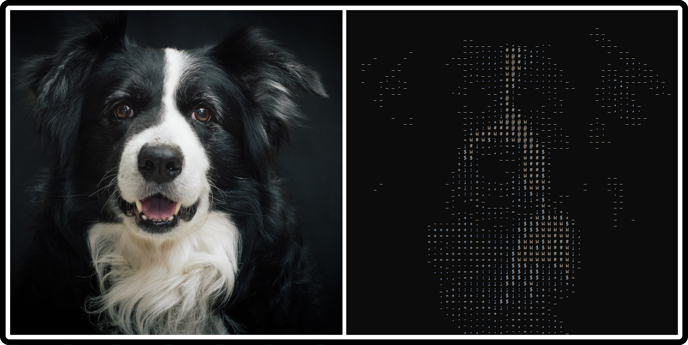
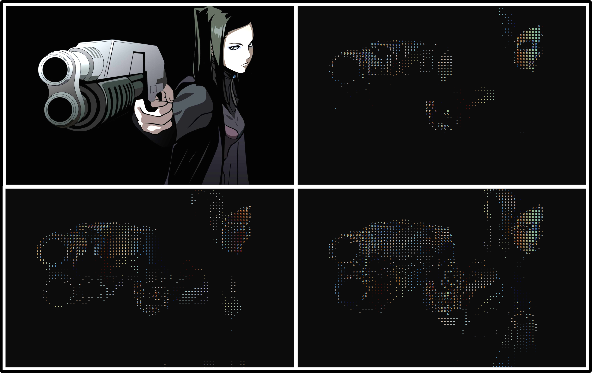

# Image2ASCII

Image2ASCII is a Python script that converts images into ASCII art and displays them in the Terminal.

## Prerequisites

- Python 3.x
- PIL (Python Imaging Library)

## Usage

1. Clone the repository or download the script.

2. Install the required dependencies using pip:

`pip install pillow`

4. Run the script with the desired options:

`python image2ascii.py [--img IMAGE] [--dim DIMENSION] [--dob {0,1}] [--lod {0,1,2}]`

4. Available options:
- `--img`: Path to the image file. Default is "image.png".
- `--dim`: The dimension by which to divide the image. Default is 20. (e.g. if the original size is 100x120 and dim is 2, the resulting output will be 50x60.)
- `--dob`: Specify 0 if the background is dark, or 1 if the image is bright. Default is 0. (Flipping this value will Invert the result.)
- `--lod`: Level of detail. Use 0 for minimalism, 2 for maximalism. Default is 1.

5. The converted ASCII art will be displayed in the Terminal.

## Examples

Here are some example usage cases sample images that demonstrate the output:

`py image2ascii.py --img dog.png --dim 30 --dob 1 --lod 1`

In this next example, all preset LODs (Level of Detail) were used:

`py image2ascii.py --dim 18 --lod 0`

`py image2ascii.py --dim 18 --lod 1`

`py image2ascii.py --dim 18 --lod 2`

## License

This project is licensed under the MIT License - see the LICENSE file for details.
